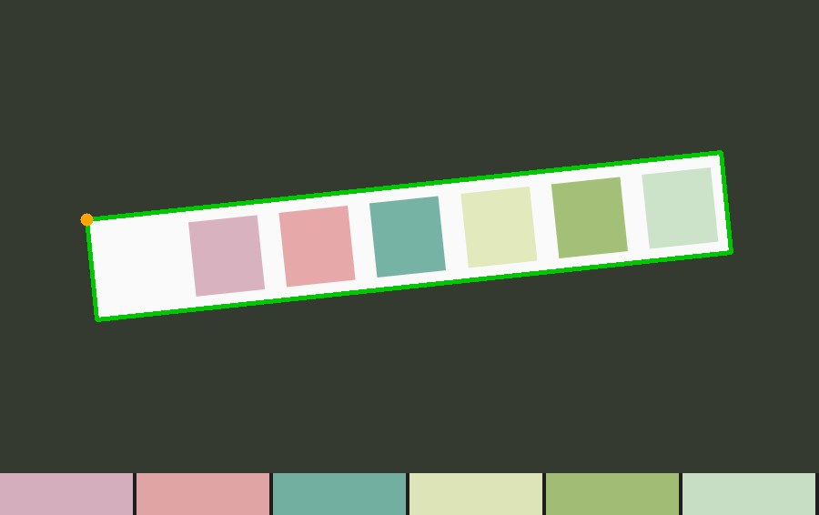

# Test Strip Reader

Reads the pad colours on a urine test strip from a photo using classical computer
vision: strip detection, perspective correction, per-pad colour sampling, white
balance, and CIE-Lab colour matching against a reference chart. No machine learning.

Educational demo, not a medical device. This reads the colours on a strip; it does
not perform the chemistry and cannot diagnose anything. Follow the instructions
supplied with your strips and confirm any result with a clinician.

Tested only on a synthetic strip. Accuracy on a real strip is unknown.



The synthetic demo strip. The green quad is the detected strip; the bar along the
bottom is the colour measured for each pad.

## Pipeline

```
photo
  locate strip      background differencing, minAreaRect on the largest
                    elongated contour
  straighten        order corners, getPerspectiveTransform, warpPerspective
  sample pads       median colour from the centre of each of N cells
  white balance     scale channels so the strip's white area reads neutral
  match             nearest chart colour in CIE-Lab by delta-E
```

Three implementation choices:

- **Median, not mean**, for the pad colour. One specular highlight drags a mean badly.
- **Lab, not RGB.** Distance in Lab approximates perceived colour difference; distance
  in RGB does not.
- **delta-E is reported as a match distance, not as confidence.** It says how close the
  measured colour is to the nearest chart colour and nothing more. A high value may mean
  glare, blur or shadow, but a low value does not confirm the reading is correct, because
  a poor white balance can shift every pad and still land close to the wrong level.

## Files

| File | Purpose |
| --- | --- |
| `strip_analyzer.py` | Detection, sampling, colour matching, CLI |
| `app.py` | Streamlit UI |
| `requirements.txt` | Dependencies |
| `samples/` | Drop your own photos here. Gitignored. |

## Setup

```bash
python3 -m venv .venv
source .venv/bin/activate
pip install -r requirements.txt
```

## Run

```bash
streamlit run app.py
```

Command line:

```bash
python strip_analyzer.py demo              # synthetic strip, no photo needed
python strip_analyzer.py selftest          # verify the pipeline
python strip_analyzer.py samples/mine.jpg  # your own photo
```

`selftest` renders the demo strip and checks that all six pads read back correctly.
It exits non-zero on failure.

`demo` and a run on your own photo both write `strip_annotated.jpg` (overlay) and
`strip_annotated_flat.jpg` (the straightened strip that actually gets sampled, which
is the useful one when debugging a bad reading).

## Before trusting a reading

**Replace the chart.** `CHART` in `strip_analyzer.py` is made-up start-up data, not
colours taken from any real product. Every manufacturer prints different colours. This
is the single biggest source of error and it is about ten lines to fix.

**Set the pad region.** Most dipsticks have a white handle. If the sampling grid
lands on it, the first pads read as false negatives. Move "Pads start at" in the
sidebar until the cells line up with the coloured squares in the straightened view.

**Validate it.** Read a real strip by eye against the packaging chart, write down the
answers, then run it through the tool and build a confusion matrix. Report that
number rather than claiming the tool works.

## Limitations

- Auto-detection needs a plain, contrasting background. Manual mode otherwise.
- Colour depends on lighting, camera white balance and screen calibration.
- The tool cannot know how long a strip has been developing. Most are read at 60 or
  120 seconds, and a photo taken at the wrong time is simply wrong.
- Pads bleed into each other on cheap strips. Only the middle 50% of each cell is
  sampled.
- Blood and leukocytes are non-specific. Menstruation, discharge and dehydration all
  affect them.

## License

MIT
