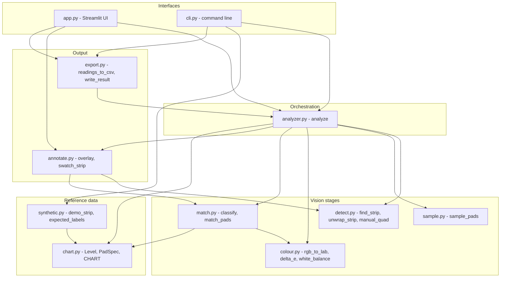
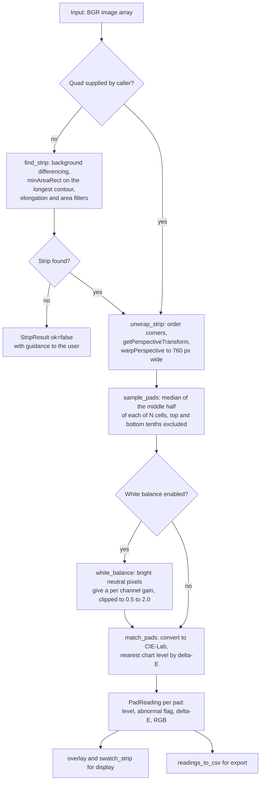
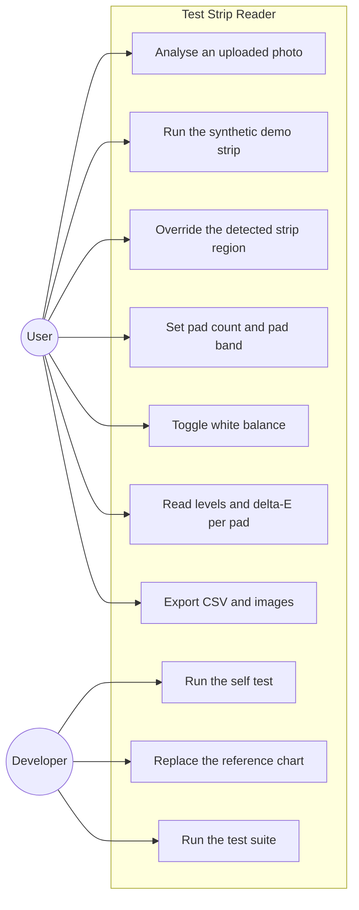
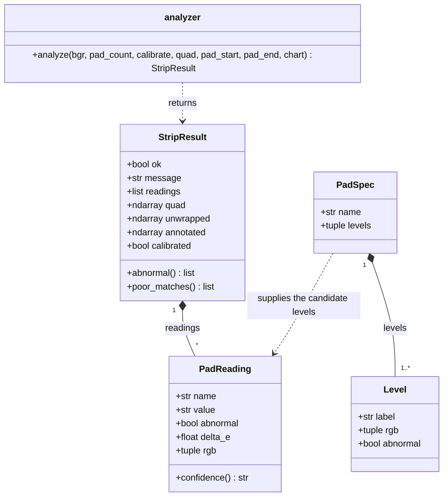
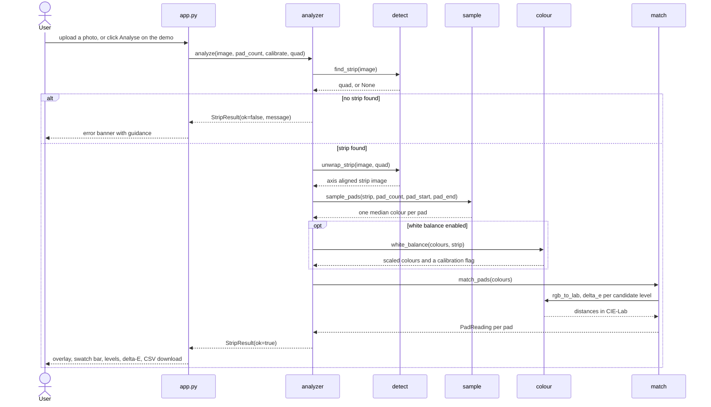

# Design

Design notes for the Test Strip Reader. The problem statement and scope are in
`statement.md`. The diagrams below are the source of truth; `docs/build_diagrams.py`
renders each Mermaid block in this file to a PNG in `docs/diagrams/`.

## Requirements

### Functional

| ID | Requirement |
| --- | --- |
| FR1 | Detect one strip in a still image against a plain background, without user input |
| FR2 | Accept a manually specified strip region when detection fails or is unwanted |
| FR3 | Rectify rotation and perspective to a fixed width, axis aligned strip image |
| FR4 | Sample one colour per pad cell from the middle of the cell, rejecting outliers |
| FR5 | Estimate and remove the lighting cast using neutral pixels inside the strip |
| FR6 | Classify each sampled colour against the reference chart and report the level |
| FR7 | Report a match distance per pad and flag levels outside the normal range |
| FR8 | Adapt to a different strip by changing pad count, pad band and chart only |
| FR9 | Export the measurements as CSV plus an annotated image and the flat strip |
| FR10 | Provide a browser interface and a command line interface over one pipeline |
| FR11 | Verify the pipeline without a physical strip via a synthetic strip generator |

### Non functional

| ID | Requirement | How it is met |
| --- | --- | --- |
| NFR1 | Performance: analyse a 900 by 520 image well under one second on CPU | Measured at 14.9 ms per analysis, averaged over 20 runs, on a laptop CPU. No GPU and no model weights are involved |
| NFR2 | Resource efficiency: run in one process with dependencies limited to OpenCV, NumPy, Pillow and Streamlit | No TensorFlow, no PyTorch, no model download at run time |
| NFR3 | Reliability: never raise on bad input, always return a result object | `analyze` returns `StripResult(ok=False, message=...)` for an empty image or a missing strip. Covered by tests |
| NFR4 | Error handling: degrade rather than fail at each stage | A failed white balance returns uncalibrated colours with `calibrated=False` instead of aborting. A failed detection suggests manual mode |
| NFR5 | Usability: the demo path needs no configuration or sample photo | The demo tab and `cli demo` render their own strip. Every number is labelled with its match quality |
| NFR6 | Maintainability: one responsibility per module, each module well under 200 lines, no circular imports | Ten modules in `strip_reader/`, static import graph, no module over 160 lines |
| NFR7 | Testability: deterministic fixtures, no network, no camera | `synthetic.demo_strip` is seeded and byte identical across runs |
| NFR8 | Portability: run on the Python 3.13 environment used in the course | Avoids mediapipe, which has no 3.13 wheels. Verified on Python 3.13.0 |

## Architecture

The package is layered so that the vision stages never import the interfaces and
the reference data never imports the stages. `app.py` and `cli.py` are the only
modules that depend on everything, and they do so through the public names in
`strip_reader/__init__.py`.

### Module dependencies

Two consequences of that shape matter. `detect.py` and `sample.py` depend on
nothing but NumPy and OpenCV, so the geometry can be tested with plain arrays and
no image files. `chart.py` has no imports at all beyond the standard library, so
the reference data can be swapped without touching any stage.

## Process flow

The pipeline is a straight chain with two guards, one before the geometry and one
inside the colour stage.

### Analysis flow

## Use cases

Two actors. The user works through the interface, the developer works on the code
and the reference data.

### Use case diagram

## Data model

Four data types carry the whole pipeline: two are the reference chart, two are the
result. Everything else is a NumPy array or a float.

### Class diagram

`Level` and `PadSpec` are frozen, so the reference chart cannot be mutated at run
time by a stray write. `PadReading` and `StripResult` are mutable containers that
are built once and then only read, and `confidence` and `abnormal` are derived
rather than stored so they cannot disagree with `delta_e`.

## Interaction

The Streamlit interface calls one function and renders the result. The sequence
below is the same for the command line, apart from the rendering step.

### Sequence diagram

## Design decisions

Median instead of mean for the pad colour. A single specular highlight inside a
cell shifts a mean by several Lab units and can move the answer a whole level. The
median ignores up to half the patch being wrong, which is why it is the only
statistic used for colour anywhere in the pipeline.

CIE-Lab instead of RGB for matching. Euclidean distance in Lab approximates
perceived colour difference; the same distance in RGB does not, because a given
step in green is far more visible than the same step in blue. The whole
classification is therefore a nearest neighbour search in Lab.

A printed reference chart instead of a trained classifier. The chart on the
packaging is already a set of labelled samples for the specific chemistry of that
product, it is free, and it is the ground truth a human reader would use. Training
a classifier would need a labelled dataset of developed strips under controlled
lighting, which does not exist for this project, and it would add a dependency that
does not run on Python 3.13. The trade off is that the chart must be transcribed by
hand, which is the single largest practical limitation of the project.

delta-E reported as a match distance, not a confidence. It measures how close the
sampled colour is to the nearest chart colour and nothing more. A large value is
informative, because it means glare, blur or shadow has likely corrupted the patch.
A small value is not a confirmation, because a bad white balance shifts every pad
and can still land close to the wrong level.

Fixed target width of 760 px after rectification. Every later stage then works in
normalised coordinates, so pad position is expressed as a fraction of the strip
rather than in pixels of the original photo. Resizing the input cannot change the
sampling geometry.

Deferred validation through a result object. Stage functions return arrays and
raise only on programmer error such as a pad count of zero. User facing failure is
signalled by `StripResult.ok` and a message, which keeps the interfaces free of
exception handling and makes the failure path testable.

## Evaluation method

There is no public dataset of developed strips with known ground truth, so the
project evaluates on a synthetic strip where the answer is known by construction.

`demo_strip` paints the chart colours onto a strip, adds Gaussian noise with a
fixed seed, rotates it, and composites it onto a contrasting background. Because
the rendered level of every pad is decided by the generator, the correctness of the
whole pipeline can be measured exactly. `cli selftest` reports the reading against
the expected level for each pad and exits non zero on any mismatch, and the test
suite asserts the same thing.

What that does not measure is accuracy on a real strip. The synthetic strip has no
bleed between pads, no glare, no shadow gradient, no paper texture and perfect
white balance input, so a passing self test says the geometry and the colour maths
are correct, not that the tool reads real strips correctly. The protocol for the
real measurement, which has not been run, is to read a set of real strips by eye
against the packaging chart first, record those answers independently, then run the
same strips through the tool and report a confusion matrix per pad, together with
the fraction of pads whose delta-E exceeded the poor match threshold.

The generator is also the test fixture, which keeps the test suite free of binary
files and makes the failure mode reproducible from the seed alone.
